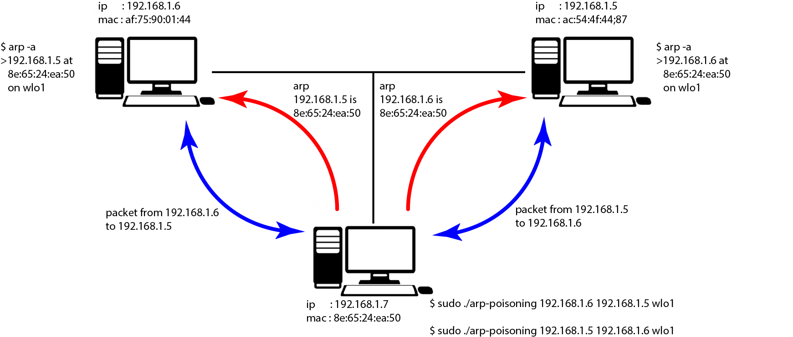

# arp_poisoning

software related to the arp protocol with the libc

the arp protocol allows to link the ip address to 
the mac address for that we send an arp 
request which says this ip address has this mac address. 

When a person wants to send a packet to an ip address he 
will look in the arp table and will not pass the mac address. 

So if we send an arp request by changing your IP, the person 
who wants to send a packet to this IP will send it to us.

## package structure

### arp

<table style="margin: 0 auto; width: 50em;">
    <tbody>
        <tr>
            <th align="center" colspan="1">+</th>
            <th align="center" colspan="8" width="25%">Bits 0 - 7</th>
            <th align="center" colspan="8" width="25%">8 - 15</th>
            <th align="center" colspan="16" width="50%">16 - 31</th>
        </tr>
        <tr>
            <th>0</th>
            <td align="center" colspan="16">Hardware type</td>
            <td align="center" colspan="16">Protocol type</td>
        </tr>
        <tr>
            <th>32</th>
            <td align="center" colspan="8">Hardware Address Length</td>
            <td align="center" colspan="8">Protocol Address Length</td>
            <td align="center" colspan="16">Operation</td>
        </tr>
        <tr>
            <th>64</th>
            <td align="center" colspan="32">Sender Hardware Address</td>
        </tr>
        <tr>
            <th>?</th>
            <td align="center" colspan="32">Sender Protocol Address</td>
        </tr>
        <tr>
            <th>?</th>
            <td  align="center"colspan="32">Target Hardware Address
            </td>
        </tr>
        <tr>
            <th>?</th>
            <td align="center" colspan="32">Target Protocol Address
            </td>
        </tr>
    </tbody>
</table>

## inspired by

- the base : https://gist.github.com/austinmarton/1922600
- SRJanel (https://github.com/SRJanel/arp_poisoning)
- multiple other source code on the internet

## Warning

made for educational purposes to learn how to use raw sockets. I am trying to code protection software